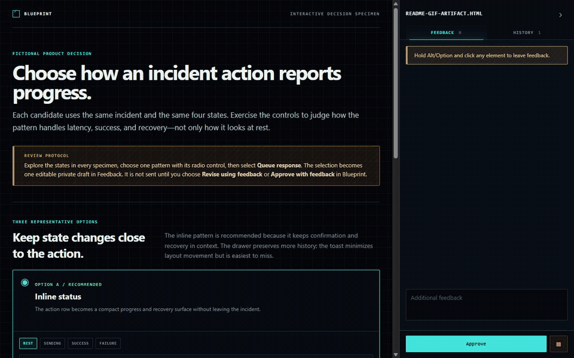

<h1 align="center">Blueprint</h1>

<p align="center"><strong>A deliberate review loop for agent-generated plans, designs, and decisions.</strong></p>

<p align="center">
  <a href="https://www.npmjs.com/package/blueprint-local-review"></a>
  <a href="LICENSE"></a>
  
  
</p>

Blueprint turns a self-contained HTML artifact into a local review surface. Point at exact elements, queue feedback privately, request a revision, inspect what changed, and approve only when you are ready.

<p align="center">
  
</p>

## Why Blueprint?

| | |
| --- | --- |
| **Point at the exact thing** | Hold Alt/Option and click any HTML element to attach precise feedback. |
| **Draft privately** | Comments and form responses stay local until you explicitly send the queued batch. |
| **Reveal revisions deliberately** | A prepared revision waits behind a human-controlled reveal gate. |
| **Verify what changed** | Inspect amendment evidence, accept or reopen items, and retain a read-only history. |

Blueprint is intentionally personal and local-first: one person, one agent, one portable artifact. It has no telemetry and does not turn review into another chat room or ticket tracker.

## Install

Blueprint requires Node.js 22 or newer.

```sh
npm install --global blueprint-local-review
```

Connect the agent you use:

```sh
blueprint setup hooks --agent codex
# or
blueprint setup hooks --agent claude
```

Installation alone never edits agent configuration. Hook setup is explicit, reversible, and preserves unrelated settings.

## Use it

Ask your agent to prepare or open a review. You do not need to operate Blueprint from the terminal during the review.

> Prepare this decision as a Blueprint review and wait for my feedback.

The loop is simple:

1. **Your agent opens an artifact.** The initial HTML appears immediately.
2. **You review it.** Select options, annotate exact elements, and queue private feedback.
3. **Your agent revises it.** The current revision remains visible while the agent works.
4. **You verify and approve.** Reveal the staged revision, inspect its amendment evidence, and close the review when it is right.

## What Blueprint is good for

- Product and architecture decisions that benefit from concrete visual options.
- UI proposals and wireframes where states and transitions matter.
- Plans and comparisons that need precise, element-level feedback.
- Review cycles where “the agent says it changed” is not enough evidence.

Blueprint is a specialist review surface, not a replacement for your coding agent. Codex and Claude Code remain where the conversation and implementation happen; Blueprint owns the human approval loop around the artifact.

## Acknowledgements

Blueprint is heavily inspired by [Lavish](https://github.com/kunchenguid/lavish-axi), created by [Kun Chen](https://github.com/kunchenguid). Lavish demonstrated how a local, agent-operated HTML review surface can make visual feedback precise and interactive. Blueprint builds on that product idea with its own narrower, human-gated revision and approval workflow.

## Learn more

- [Product principles and settled decisions](docs/PRODUCT.md)
- [Architecture, security, and recovery](docs/ARCHITECTURE.md)
- [Development and contributor notes](docs/DEVELOPMENT.md)
- [MIT license](LICENSE)
